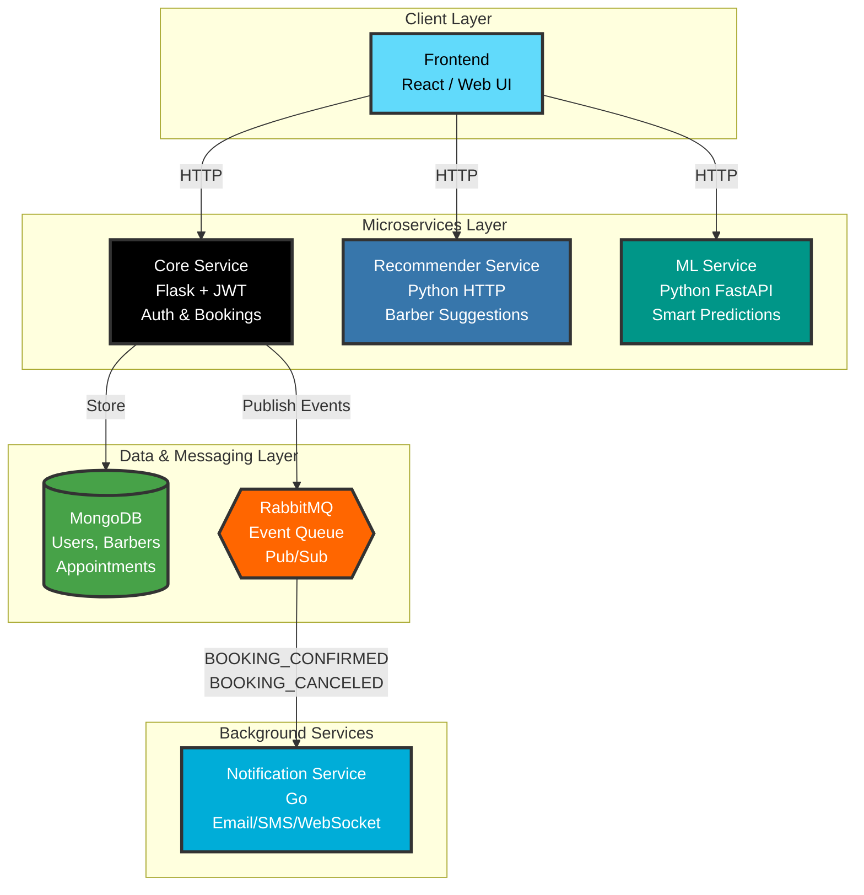

# Barbershop Appointment System

A modular, microservices-based platform that enables barbers and clients to manage appointments efficiently. The system supports real-time notifications, smart ML-based predictions, and personalized barber recommendations.
---

## Architecture Diagram


---

## Components

### Core Service
- Built with **Flask**
- Responsibilities:
  - User & Barber Registration/Login
  - Availability Slot Management
  - Appointment Booking
  - JWT Authentication
  - Publishes events to **RabbitMQ**
  - Stores data in **MongoDB**

### Notification Service
- Written in **Go**
- Subscribes to booking events via **RabbitMQ**
- Sends real-time notifications (Email/SMS/WebSockets)

### ML Service
- Provides:
  - Smart suggestions (e.g., best slots)
- Consumed **directly by the Frontend** via HTTP

###  Recommender Service
- Suggests top barbers based on:
  - Estimated haircut type based on face features
  - Preferences
- Exposed over HTTP and **consumed by the Frontend**

---

## MongoDB

Stores collections for:
- Users
- Barbers
- Appointments
- Available Slots
- Embedded Notifications

---

## RabbitMQ (Pub/Sub)

- Core Service publishes:
  - `BOOKING_CONFIRMED`
  - `BOOKING_CANCELED`
- Notification Service consumes events

---

## 📁 Folder Structure

```
.
├── core-service/
├── notification-service/
├── ml-service/
├── recommender-service/
├── frontend/
├── tests/
└── README.md
```

---

## Getting Started

### Requirements

- Docker
- Python 3.10+
- Go 1.20+
- Node.js (for frontend, optional)

### ▶️ Run Services

```bash
cd into the service folder
make build
make run
```

---

## 👥 Contributors

- **Group 8**: Group 8

---
